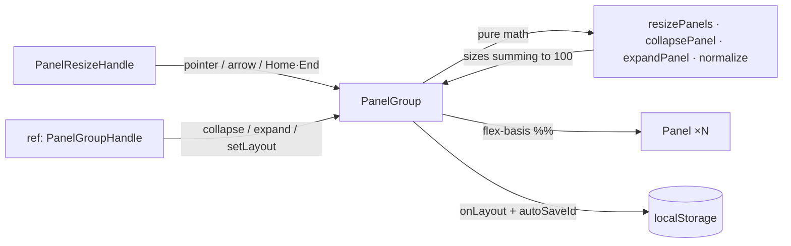

<div align="center">


# react-resizable-panels

**Resizable split panels for React — drag, collapse, persist, and keyboard-resize, with a tiny pure-math core.**

_Built and maintained by Viprasol Tech_

[](https://github.com/Viprasol-Tech/react-resizable-panels/actions/workflows/ci.yml)
[](https://github.com/Viprasol-Tech/react-resizable-panels/blob/main/LICENSE)
[](https://www.npmjs.com/package/react-resizable-panels)
[](https://www.typescriptlang.org/)
[](https://react.dev/)
[](#-features)
[](#-testing)

</div>

---

## ✨ Features

- 🪟 **Real resize math** — dragging a handle redistributes percentage sizes between adjacent panels, normalized to sum exactly 100%.
- 📏 **Min / max constraints** — per-panel `minSize` / `maxSize`; when a neighbor hits its limit the leftover delta cascades to the next panel.
- 🫥 **Collapsible panels** — opt in with `collapsible`; drag a panel shut, or call `ref.collapse()` / `ref.toggle()`. Optional non-zero `collapsedSize`.
- 🖱️ **Double-click to reset** — double-click any handle to snap its two panels back to their default split.
- ⌨️ **Keyboard accessible** — handles are `role="separator"`; arrow keys nudge, `Home` / `End` jump fully one way, and the tab order respects `disabled`.
- 🎛️ **Imperative API** — a forwarded `ref` exposes `getLayout`, `setLayout`, `collapse`, `expand`, `toggle`, `isCollapsed`, and `reset`.
- 💾 **Persisted layout** — set `autoSaveId` and the size array is saved to `localStorage` and restored on reload.
- 🧱 **Nested groups** — drop a `<PanelGroup>` inside any `<Panel>` for IDE-style split layouts.
- 🔔 **Lifecycle callbacks** — `onLayout`, plus per-panel `onResize` / `onCollapse` / `onExpand`.
- 🪶 **Tiny & dependency-free** — pure React + a small, unit-tested math core. Strict TypeScript, zero runtime deps.

## 📦 Install

```bash
npm i react-resizable-panels
```

`react` and `react-dom` (>=18) are peer dependencies.

## 🚀 Usage

A classic three-pane editor with a collapsible sidebar, persisted layout, and a
toolbar button driven by the imperative ref:

```tsx
import { useRef } from "react";
import {
  PanelGroup,
  Panel,
  PanelResizeHandle,
  type PanelGroupHandle,
} from "react-resizable-panels";

export function Editor() {
  const ref = useRef<PanelGroupHandle>(null);

  return (
    <div style={{ height: 480 }}>
      <button onClick={() => ref.current?.toggle("sidebar")}>
        Toggle sidebar
      </button>

      <PanelGroup
        ref={ref}
        direction="horizontal"
        autoSaveId="editor-layout"
        onLayout={(sizes) => console.log("layout", sizes)}
      >
        <Panel id="sidebar" defaultSize={22} minSize={15} collapsible>
          <Sidebar />
        </Panel>

        {/* Double-click resets this divider to the default split. */}
        <PanelResizeHandle handleIndex={0} />

        <Panel defaultSize={53} minSize={25}>
          {/* Nested vertical split inside the main panel */}
          <PanelGroup direction="vertical">
            <Panel defaultSize={70}>
              <CodeView />
            </Panel>
            <PanelResizeHandle handleIndex={0} />
            <Panel defaultSize={30} minSize={10} collapsible>
              <Terminal />
            </Panel>
          </PanelGroup>
        </Panel>

        <PanelResizeHandle handleIndex={1} />

        <Panel defaultSize={25} minSize={15}>
          <Preview />
        </Panel>
      </PanelGroup>
    </div>
  );
}
```

The pure resize core is also exported if you want to drive layout yourself:

```ts
import { resizePanels, collapsePanel, expandPanel } from "react-resizable-panels";

// Move handle 0 (between panel 0 and 1) by +10%, panel 1 floored at 30%.
resizePanels([50, 50], 0, 10, [{}, { min: 30 }]); // => [60, 40]

// Collapse panel 0 to 0% and hand the freed space to its neighbor.
collapsePanel([30, 70], 0, [{ collapsible: true }, {}]); // => [0, 100]

// Expand panel 0 back to its min, pulling space from neighbors.
expandPanel([0, 100], 0, [{ min: 20 }, {}]); // => [20, 80]
```

## 🧭 How it works



Sizes are always percentages of the group that sum to 100, which keeps layouts
responsive to container resizes without any pixel bookkeeping. All the drag and
collapse math lives in a tiny pure module so it can be unit-tested with
hand-computed values and reused outside React.

## 📖 API

### `<PanelGroup>`

| Prop                | Type                          | Default        | Description                                                       |
| ------------------- | ----------------------------- | -------------- | --------------------------------------------------------------- |
| `direction`         | `"horizontal" \| "vertical"`  | `"horizontal"` | Layout axis.                                                     |
| `autoSaveId`        | `string`                      | —              | `localStorage` key used to persist and restore the layout.       |
| `onLayout`          | `(sizes: number[]) => void`   | —              | Called with the new size array (summing to 100) on change.       |
| `collapseThreshold` | `number`                      | `5`            | Percentage points below `minSize` a collapsible panel snaps shut. |
| `className`         | `string`                      | —              | Class applied to the group container.                            |
| `style`             | `CSSProperties`               | —              | Inline style merged onto the flex container.                     |
| `ref`               | `Ref<PanelGroupHandle>`       | —              | Imperative handle (see below).                                   |

### `PanelGroupHandle` (via `ref`)

| Method                              | Description                                                       |
| ----------------------------------- | --------------------------------------------------------------- |
| `getLayout(): number[]`             | Current layout as percentages summing to 100.                   |
| `setLayout(sizes: number[])`        | Replace the whole layout (normalized internally).               |
| `collapse(target)`                  | Collapse the panel at index or `id`.                            |
| `expand(target, size?)`             | Expand the panel to `size`, its min, or an even share.          |
| `toggle(target)`                    | Toggle collapse/expand for the panel.                           |
| `isCollapsed(target): boolean`      | Whether the panel is currently collapsed.                       |
| `reset()`                           | Reset every panel to its `defaultSize`.                         |

### `<Panel>`

| Prop            | Type            | Default | Description                                          |
| --------------- | --------------- | ------- | --------------------------------------------------- |
| `id`            | `string`        | —       | Stable id for imperative addressing.                |
| `defaultSize`   | `number`        | even    | Initial size in percent.                            |
| `minSize`       | `number`        | `0`     | Minimum size in percent.                            |
| `maxSize`       | `number`        | `100`   | Maximum size in percent.                            |
| `collapsible`   | `boolean`       | `false` | Allow the panel to collapse below `minSize`.        |
| `collapsedSize` | `number`        | `0`     | Size in percent the panel collapses to.             |
| `onResize`      | `(size) => void`| —       | Fired with the panel's new size on every change.    |
| `onCollapse`    | `() => void`    | —       | Fired when the panel becomes collapsed.             |
| `onExpand`      | `() => void`    | —       | Fired when the panel leaves the collapsed state.    |
| `className`     | `string`        | —       | Class applied to the panel element.                 |
| `style`         | `CSSProperties` | —       | Inline style merged onto the panel.                 |

### `<PanelResizeHandle>`

| Prop                 | Type            | Default | Description                                          |
| -------------------- | --------------- | ------- | --------------------------------------------------- |
| `handleIndex`        | `number`        | —       | Index of the panel immediately before the handle.   |
| `keyboardStep`       | `number`        | `5`     | Percentage points moved per arrow-key press.        |
| `disabled`           | `boolean`       | `false` | Disable drag + keyboard; removes it from tab order.  |
| `resetOnDoubleClick` | `boolean`       | `true`  | Double-click resets the adjacent panels to default.  |
| `className`          | `string`        | —       | Class applied to the handle element.                |
| `style`              | `CSSProperties` | —       | Inline style merged onto the handle.                |

### Pure helpers

| Function                                            | Description                                                       |
| --------------------------------------------------- | --------------------------------------------------------------- |
| `resizePanels(sizes, index, deltaPct, constraints)` | Move a handle by `deltaPct`, honoring constraints, summing to 100. |
| `collapsePanel(sizes, index, constraints)`          | Collapse a panel to its `collapsedSize`, giving space to a neighbor. |
| `expandPanel(sizes, index, constraints, size?)`     | Expand a panel back, pulling space from neighbors.              |
| `resetToDefaults(defaults, constraints)`            | Build the default layout from per-panel default sizes.         |
| `applyCollapseSnap(sizes, constraints, threshold)`  | Snap collapsible panels shut / clamp others after a drag.      |
| `isCollapsed(size, constraint)`                     | Whether a size represents a collapsed panel.                   |
| `normalize(sizes)`                                  | Scale any size array so it sums to exactly 100.                |
| `distributeEvenly(count, constraints)`              | Build an even default layout for `count` panels.               |
| `pxDeltaToPct(deltaPx, groupSizePx)`                | Convert a pixel drag delta into a percentage delta.            |

## ⌨️ Keyboard

| Key                        | Action                                  |
| -------------------------- | --------------------------------------- |
| `ArrowLeft` / `ArrowUp`    | Shrink the panel before the handle.     |
| `ArrowRight` / `ArrowDown` | Grow the panel before the handle.       |
| `Home`                     | Move the divider fully toward the start.|
| `End`                      | Move the divider fully toward the end.  |

## 🧪 Testing

```bash
npm install
npm test          # vitest run — 55 tests (pure math + component render/interaction)
npm run typecheck # tsc --noEmit
```

Component tests use `@testing-library/react` to drive real pointer drags,
keyboard input, double-click resets, and the imperative ref.

## 🗺️ Roadmap

- [x] Pointer drag resizing with min/max cascade
- [x] Horizontal & vertical layouts
- [x] `localStorage` persistence (`autoSaveId`)
- [x] Collapse / expand + double-click reset
- [x] Imperative `ref` API
- [x] Keyboard resize (arrows + Home/End)
- [x] Nested groups
- [ ] Touch-pinch gesture support
- [ ] RTL-aware horizontal layouts
- [ ] Conditionally rendered (mounting/unmounting) panels with size memory

## ❓ FAQ

**Do sizes have to be percentages?**
Yes — internally everything is percent-of-group summing to 100, which keeps
layouts fluid as the container resizes. Use `pxDeltaToPct` to bridge pixels.

**How do I make a panel start collapsed?**
Render with `collapsible` and call `ref.current?.collapse(id)` in an effect, or
set `defaultSize` to its `collapsedSize`.

**Does it work without JavaScript hydration mismatches?**
The first render uses your `defaultSize` props; persisted sizes from
`autoSaveId` are read on the client only, after mount.

**Can I style the collapsed state?**
Yes — collapsed panels expose `data-panel-collapsed`, and disabled handles
expose `data-disabled` / `aria-disabled`.

## 🤝 Contributing

Contributions are welcome. Please read [CONTRIBUTING.md](CONTRIBUTING.md) and our [Code of Conduct](CODE_OF_CONDUCT.md). Open an issue to discuss substantial changes before sending a PR.

## Contact — Viprasol Tech Private Limited

- Website: [viprasol.com](https://viprasol.com)
- Email: [support@viprasol.com](mailto:support@viprasol.com)
- Telegram: [t.me/viprasol_help](https://t.me/viprasol_help) | WhatsApp: +91 96336 52112
- GitHub: [@Viprasol-Tech](https://github.com/Viprasol-Tech) | [LinkedIn](https://www.linkedin.com/in/viprasol/) | X [@viprasol](https://twitter.com/viprasol)

## License

[MIT](LICENSE) (c) 2025 Viprasol Tech Private Limited
